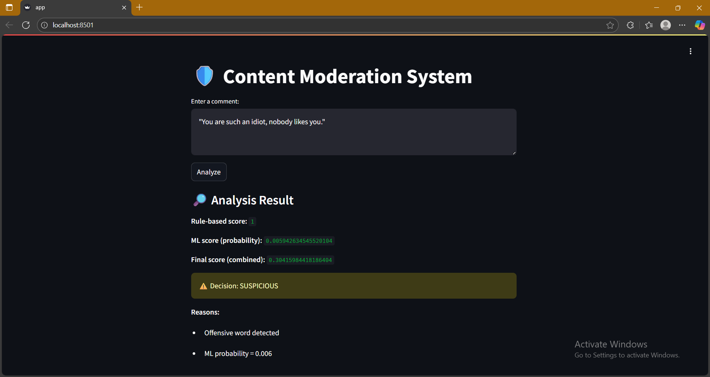
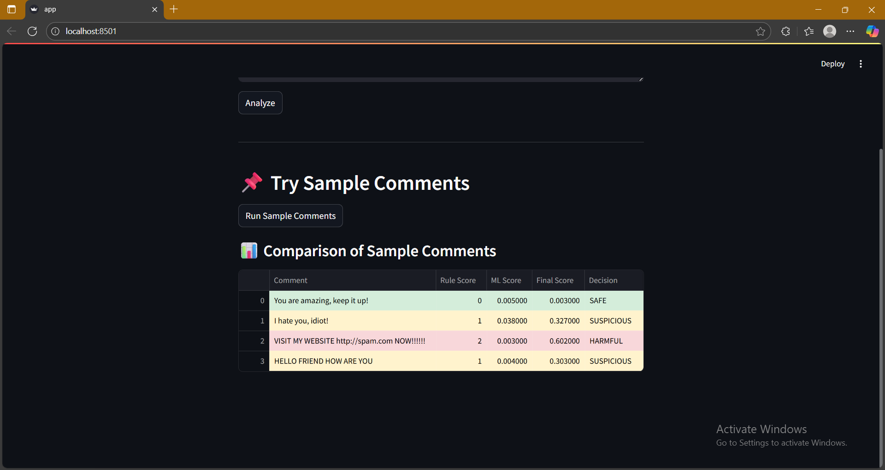

# 🛡️ Content Moderation System

## 📖 Overview
This project is a **Content Moderation System** designed to analyze user-generated text (e.g., chat messages, comments, social media posts) and classify them as **SAFE**, **SUSPICIOUS**, or **HARMFUL**.  
The system combines **rule-based techniques** (detecting offensive words, repeated characters, URLs, excessive capitalization) with **machine learning models** to improve detection accuracy.

---

## ⚙️ Features
- **Rule-based Filtering**  
  - Detects offensive words, hate speech, threats, insults, spam-like content, and URLs.  
- **Machine Learning Models**  
  - TF-IDF vectorization + classifiers: Logistic Regression, SVM, Random Forest, XGBoost.  
- **Hybrid Scoring System**  
  - Weighted combination of rule-based score and ML probability for final decision.  
- **Streamlit Web App**  
  - User-friendly interface for inputting text.  
  - Shows scores, final decision, and reasons for moderation.

## 🖥️ User Interface (UI)

The system has a simple and interactive **Streamlit interface** where users can input comments and get instant moderation results.  

### Example Screenshot



- **Text Area:** Users type any comment or text.  
- **Analyze Button:** Runs the hybrid moderation system.  
- **Results Panel:** Shows scores, final decision, and reasons for flagging.  

---

## 📂 Project Structure

content_moderation/
│── data/
│ ├── train.csv
│ ├── test.csv
│── models/
│ ├── log_reg_model.pkl
│ ├── svm_model.pkl
│ ├── random_forest_model.pkl
│ ├── xgboost_model.pkl
│ ├── tfidf_vectorizer.pkl
│── app.py
│── train.py
│── rules.py
│── README.md
│── requirements.txt 

---

## 🚀 Setup & Installation

1️⃣ **Clone the repository**  
```bash
git clone https://github.com/your-username/content-moderation.git
cd content-moderation

2️⃣ Create a virtual environment & activate it 
python -m venv venv
source venv/bin/activate   # Mac/Linux
venv\Scripts\activate      # Windows

3️⃣ Install dependencies
pip install -r requirements.txt
 
 🏋️ Training Models

Run the training script to train ML models and save them: 

python train.py

This generates .pkl files in models/:

log_reg_model.pkl

svm_model.pkl

random_forest_model.pkl

xgboost_model.pkl

tfidf_vectorizer.pkl 

🎯 Running the Streamlit App

streamlit run app.py

Example Interaction

I hate you, idiot!

Analysis Result:

Rule-based score: 1
ML score: 0.038
Final score: 0.326
Decision: SUSPICIOUS
Reasons:
- Offensive word detected
- ML probability = 0.038

📌 Scoring System

Rule-based score: Count of rule violations (0–4).

ML score: Probability predicted by the model (0–1).

Final score: Weighted sum: (rule_score * 0.3) + (ML_prob * 0.7)

Decision:

SAFE → final score below threshold

SUSPICIOUS → final score above threshold

HARMFUL → final score high

👩‍💻 Author

Zeinab Ahmed
AI & Data Science Enthusiast